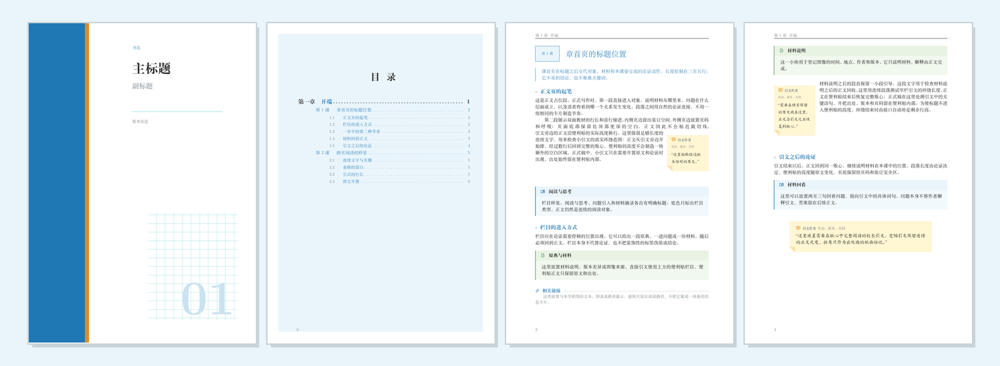
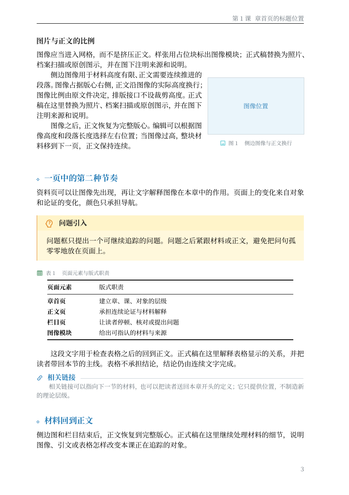

# A4 中文书籍 LaTeX 模板

[](https://github.com/OEOTYAN/LaTeX-textbook-template/actions/workflows/build.yml)

这是一个可直接编译的中文 A4 双面书籍母版。它把封面内页、前言、目录、正文、材料栏、侧边图像、自动引文、表格和数学公式放在同一套网格里；`chapters/sample.tex` 使用章、课层级展示页面接口，这只是校样示例，正式项目可以改成部分、章、节或其他层级。



上图由当前 `main.tex` 编译后的 PDF 直接渲染。

## 快速开始

在仓库根目录执行：

```powershell
.\build.ps1
.\build.ps1 -Format html -Engine xelatex
.\build.ps1 -Format epub -Engine xelatex
```

脚本默认调用本机 `tectonic`，输出写入 `build/`。已有 TeX Live 时可以执行：

```powershell
.\build.ps1 -Engine xelatex
```

也可以直接运行 `tectonic -X compile --outdir build main.tex`。目录和引文排法需要更新时，Tectonic 会自动重跑；XeLaTeX 模式由脚本重编到自动引文记录稳定为止。HTML 和 EPUB 使用 TeX4ht 的流式语义输出：每个 `section`（模板中的课/节）进入独立 XHTML 页面，目录跨页链接跳转，网页不按 A4 硬分页。

## 目录结构

```text
main.tex                       文档入口与前置页
preamble.tex                   版式和全部可复用接口
chapters/frontmatter/foreword.tex
                              前言视觉校样入口
scripts/package_epub.py       将节页 XHTML 打包为 EPUB 3
tex4ht.cfg                    HTML/EPUB 按 section 拆页配置
web.css                       HTML/EPUB 的流式阅读样式
chapters/sample.tex            视觉校样章节
styles/                        网格、母版、平面计划、审美检查
fonts/                         Noto CJK 正文字体与 Material Design Icons
licenses/                      字体许可与归属说明
.github/workflows/build.yml    GitHub Actions 自动构建
AGENTS.md                      协作和校样约定
template-preview.pdf           最近一次人工校样
```

## 示例层级接口

- `\chapter{...}`：当前校样的第一层标题，35 × 27 mm 编号块，34 pt 黑色重标题。
- `\section{...}`：当前校样的第二层标题，20 × 12 mm 浅蓝编号块，20 pt 蓝色标题；两位数编号也有预留宽度。
- `\subsection{...}`：当前校样的第三层标题，14 pt 蓝色标题。
- 正文：中文小四，1.20 倍行距，首行缩进 2em，双面内外侧边距由 `geometry` 统一管理。

## 栏目接口

问题栏目默认使用 `head-question-outline`。按语境替换时，`preamble.tex` 提供 `\mdiChatQuestion`、`\mdiLightbulbQuestion`、`\mdiFileQuestion`、`\mdiTableQuestion`、`\mdiBeakerQuestion`、`\mdiFolderQuestion`、`\mdiCommentQuestion` 和 `\mdiMessageQuestion`。

### 前言

前言正文放在独立文件中，用 `\bookforeword` 生成标题、目录登记和无页眉的前言页样式：

```latex
\bookforeword
这里接着写前言正文。
```

封面后的扉页仍由 `main.tex` 装配，书名、作者、版本和出版信息都是可替换字段。

### 小引文

小引文从段首调用，正文沿便利贴的实际高度环绕：

```latex
\sidequote[r][0.24\linewidth]{作者}{作品、版本、页码}{经过版本核对的原文。}
这里接着写正文，文字会在便利贴旁边排版。
\bookwrapclear
```

`\bookwrapclear` 在进入下一个标题或栏目之前收束环绕状态。章节内容不要用临时 `\clearpage` 来隔离引文。

### 大引文

```latex
\begin{fullquote}{作者}{作品、版本、页码}
这里放需要在版心中完整阅读的原文。
\end{fullquote}
```

`fullquote` 会先按 40% 版心量高：短引文贴在外侧，当前页放不下、会跨页或后文不足以环绕时自动改成 90% 版心的宽幅块。作者、作品和版本信息位于同一条出处行，折角为固定 5 mm 的纸面标记。XeLaTeX 构建脚本会重编到 side/full 记录稳定。

### 出处

正文出处统一使用 `\sourcecite{...}`。默认生成脚注；需要切换为文中括注时，在文档中调用 `\sourcecitesinline`。同一处出处紧邻重复时可用 `\sourceciteagain{...}` 复用上一个脚注号；脚注需要展开长出处时使用 `\sourcecite[完整出处]{正文短写}`。

### 图像与表格

侧边材料使用 `\sideplaceholder` 或 `\sideimage`，全宽材料使用 `\fullplaceholder` 或 `\fullimage`。图像保持原比例，图注登记对象和来源。

表格使用 `booktable`，表题使用 `\tablecaption{...}`：

```latex
\tablecaption{表 1　页面元素与版式职责}
\begin{booktable}{@{}p{27mm}X@{}}
  ...
\end{booktable}
```

### 数学

行内公式写作 `$...$`，不改变中文正文的基线行距。`$$...$$` 会进入 TeX 的陈列公式模式，公式独占一行；无编号陈列使用 `\[...\]` 或 `equation*`，带编号的行间公式使用 `equation`，多行推导使用 `align`。编号按章递增，形式为 `(章.序号)`，交叉引用使用 `\label` 和 `\eqref`。数学字形由随稿的 STIX Two Math 2.13 b171 提供，`unicode-math` 负责加载；`amsmath` 与 `mathtools` 仍用于公式环境和排版控制。正文中的 `\texttt{...}` 使用随稿的 Noto Sans Mono CJK SC。

## 字体与许可

中文正文固定使用仓库内的 Noto Serif SC 2.003（常规、粗体）和 Noto Sans CJK SC 2.004（常规、粗体），等宽文字使用 Noto Sans Mono CJK SC 2.004，数学使用 STIX Two Math 2.13 b171；均以 SIL Open Font License 1.1 原样分发。来源、版本、版权归属和许可证见 `fonts/README.md`、`licenses/Noto-CJK-ATTRIBUTION.txt`、`licenses/STIX-Two-ATTRIBUTION.txt`、`licenses/OFL-1.1-Noto-CJK.txt` 与 `licenses/OFL-1.1-STIX-Two.txt`；文件校验值见 `fonts/SHA256SUMS.txt`。

`main.tex` 使用 `fontset=none`，`preamble.tex` 通过相对路径显式加载字体，并固定 ctex 的宋体、黑体、仿宋、楷体和等宽接口。字体搜索路径固定为仓库的 `fonts/`；相同字体文件固定了字形和度量。逐页完全一致仍需要相同的 XeTeX/Tectonic 与 LaTeX 包版本，Actions 已固定 TeX Live 2025。栏目图标 `fonts/materialdesignicons-webfont.ttf` 独立采用 Apache License 2.0，归属见 `licenses/MaterialDesign-Webfont-NOTICE.txt`。

## 页面细节预览



## 自动构建

`.github/workflows/build.yml` 在 `main` 的 push、Pull Request 和手动触发时运行固定版本的 XeLaTeX，先校验随稿字体，再上传 PDF、HTML 和 EPUB artifact。HTML/EPUB 作业使用 TeX4ht 和按节拆页配置，电子书由 `scripts/package_epub.py` 组装为 EPUB 3。

本地输出位置：`build/html/main.html` 是目录页，`mainse1.html`、`mainse2.html` 等是独立节页；`build/main.epub` 是对应的 EPUB 3 文件。

## 校样顺序

1. 编译并确认目录、交叉引用和自动引文排法已稳定。
2. 渲染封面、目录、章首页、课首页、引文页、表格页和公式页。
3. 检查标题基线、目录编号栏、引导线、折角、表格上下留白和外侧页码。
4. 运行 `git diff --check`，确认提交中没有日志、临时图片和 `build/` 文件。

正式书名、作者、出版社和章节正文仍是待替换字段；模板不预设理论内容。
